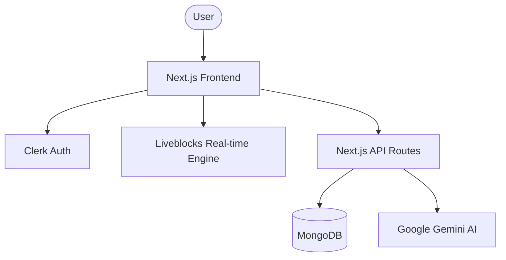

# Architecture Overview

The Student Study Tool is built with a focus on real-time collaboration, scalability, and seamless AI integration.

## Application Structure

The project follows the **Next.js App Router** architecture, ensuring efficient routing and server-side rendering.

## Key Architectural Decisions

### 1. Real-time Engine (Liveblocks & Yjs)
We use **Liveblocks** as the backbone for collaboration. It provides the infrastructure for synchronized state (Presence, Storage) across multiple clients. **Yjs** is used within the collaborative editor to handle Conflict-free Replicated Data Types (CRDTs), ensuring that users can edit documents simultaneously without conflicts.

### 2. AI Integration Layer
AI features are integrated through specialized API routes that communicate with **Google Gemini**. We've implemented a robust prompt management system to ensure high-quality AI responses for document querying and translation.

### 3. Data Persistence
While Liveblocks handles the real-time state, **MongoDB** (via Mongoose) is used for long-term persistence of user data, document metadata, and application settings.

### 4. Component-Based UI
The UI is built using a combination of **Shadcn UI** and **Tailwind CSS**, favoring a modular and highly customizable approach. **Framer Motion** is used for polished transitions and interactive micro-animations.

### 5. Authentication
**Clerk** handles the entire authentication lifecycle, providing secure sign-in, sign-up, and user profile management, which integrates seamlessly with the Next.js middleware.
